## Library Management System

This is a Library Management System project built using  Entity Framework Core version 7, SQLite and Bootstrap. The system is designed to manage books, authors, library branch and customers.

This is a project for university.

## Project Features
1. List of book
2. Create and Edit books
3. Details of book 
4. List of authors
5. Create and Edit authors
6. Details of authors 
7. List of customers
8. Create and Edit customers
9. Details of customers
10. List of Libraries branchs
11. Create and Edit libraries branch
12. Details of Libraries branch
13. Seach (Only for books)
14. Social Network Login
15. Authentication

## Prerequisites
- Visual Studio Code
- .NET Core SDK
- SQLite
- Entity Framework Core 7
- Bootstrap

## Getting Started

### 1. Clone the Repository

git clone https://github.com/laloohflorescruz/library.git
cd LibraryProject

## Tool Required:
-dotnet tool install --global dotnet-ef --version 7.0.0
-dotnet add package Microsoft.EntityFrameworkCore
-dotnet add package Microsoft.EntityFrameworkCore.Design
-dotnet add package Microsoft.EntityFrameworkCore.SQLite  

 
## 1. Run the project
-dotnet run 

### 2. Install Dependencies
dotnet restore

### 3. Database Migration

#### 3.1 Run Database Migrations

-cd LibraryProject
-dotnet ef migrations add InitialCreate (If you want create a new database empty)
-dotnet ef database update

### 4. Run the Project

-dotnet run

### 5. Release the Project

-If you want release the project, you could run: dotnet publish -c Release -o library

The application will be accessible at `https://localhost:7243/` by default.

## Project Structure

- **LibraryProject/**
  - **Controllers/** - Contains the controllers for handling HTTP requests.
  - **Models/** - Contains the data models used in the application.
  - **ViewsModel/** - Contains the viewmodel used in the application.
  - **Views/** - Contains the HTML templates and Razor files.
  - **Repo/** - Contains a generic repository with its interface.
  - **wwwroot/** - Contains static files such as CSS, JavaScript, and images.
  - **appsettings.json** - Configuration file for the application.
  - **Startup.cs** - Configures services and the app's request pipeline.

## Social Network
If you want to use any social network like authentication, just click on which you want you prefer. Be use you insert your email registred on that social network.

## You can see a live demo here
[Here](https://www.eduardoflores.name/portfolio/LibraryManagement/)

## Demo Pictures

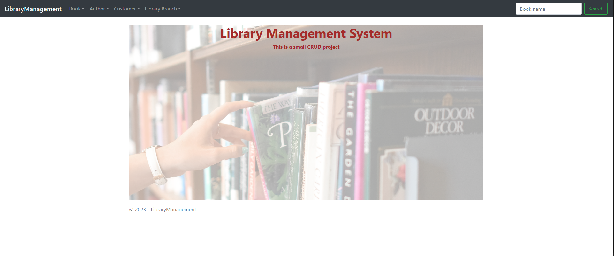
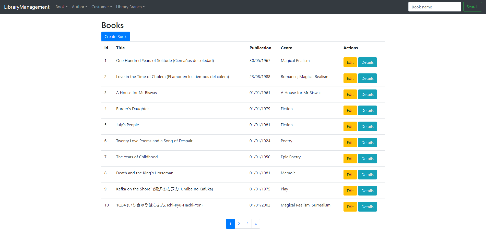
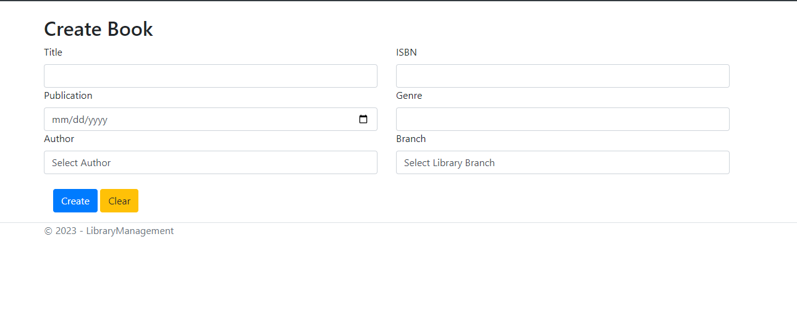
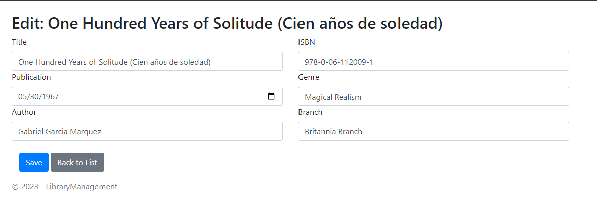
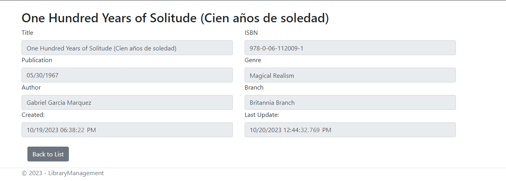
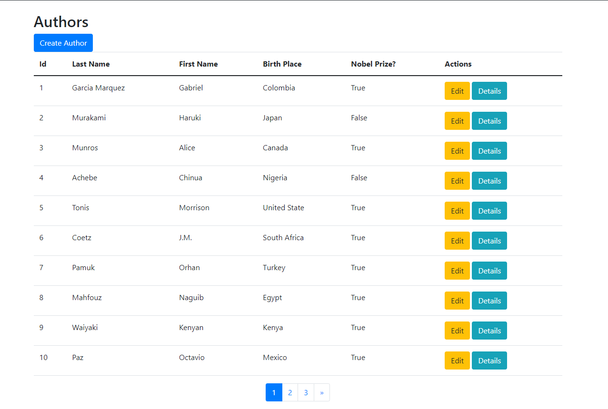
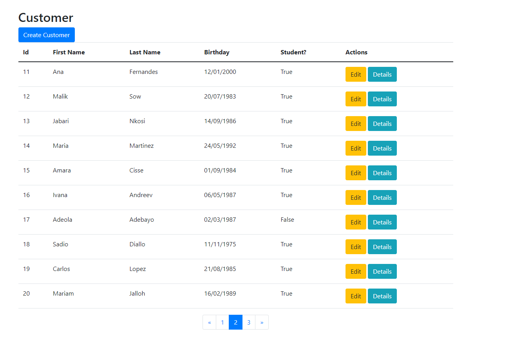
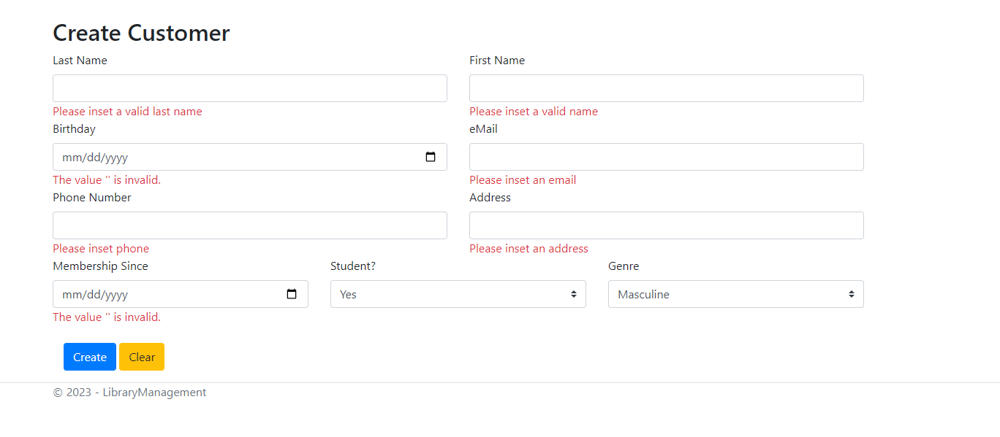
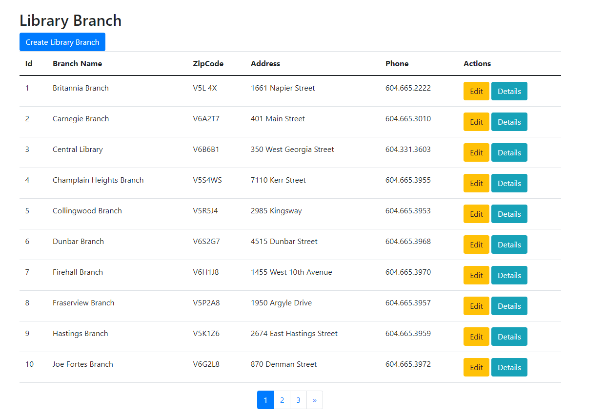
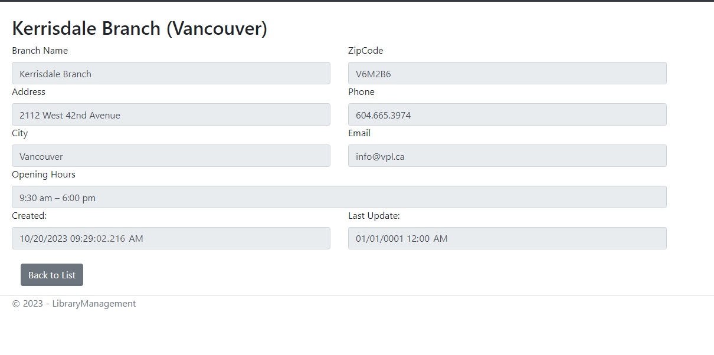
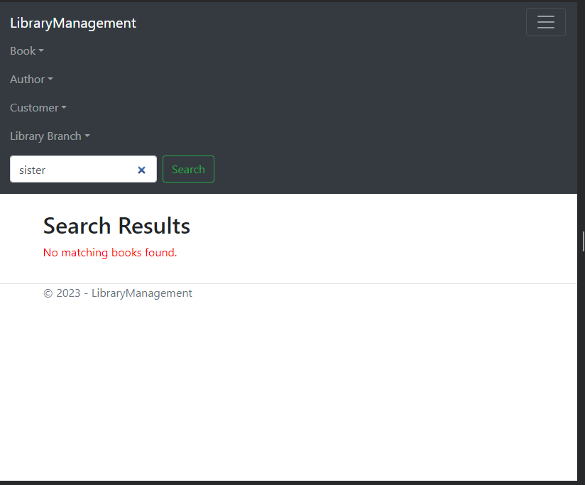
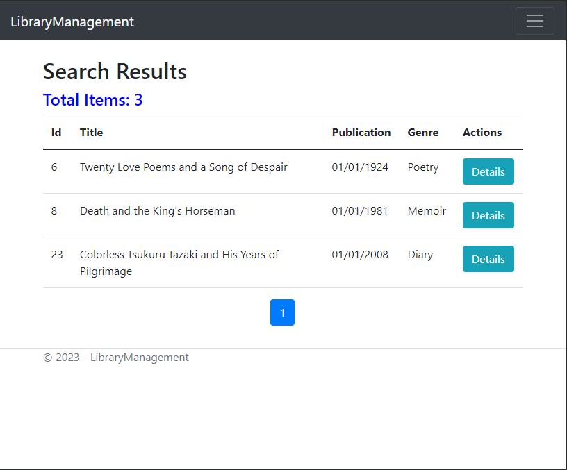
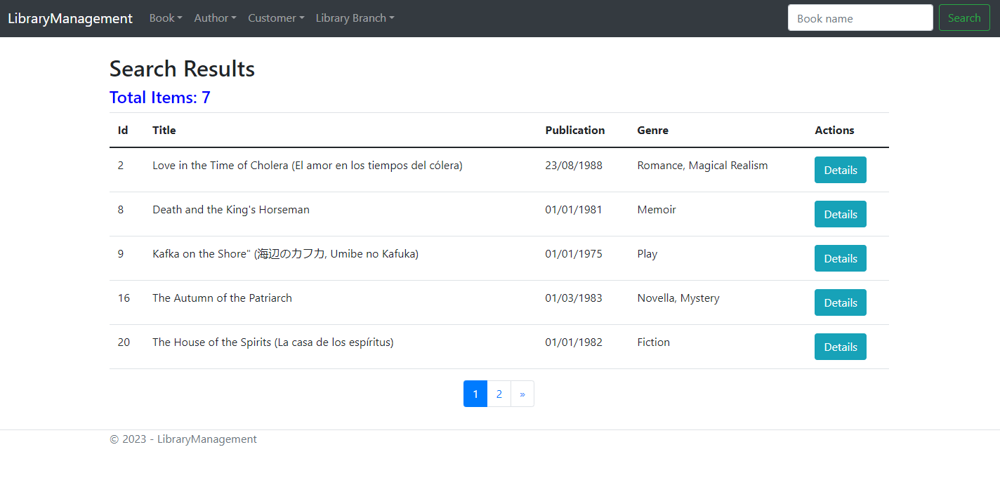
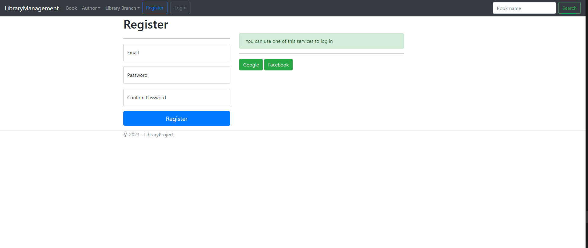
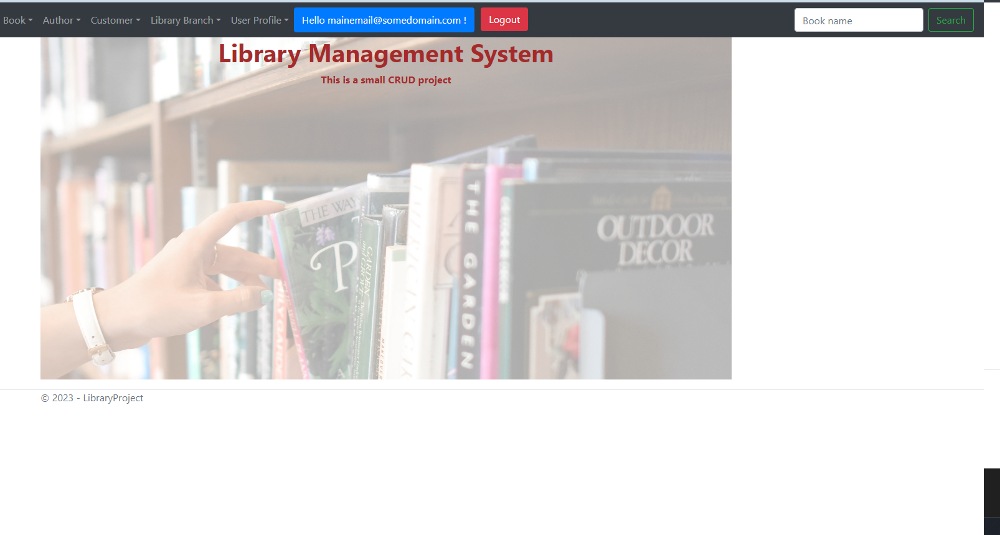
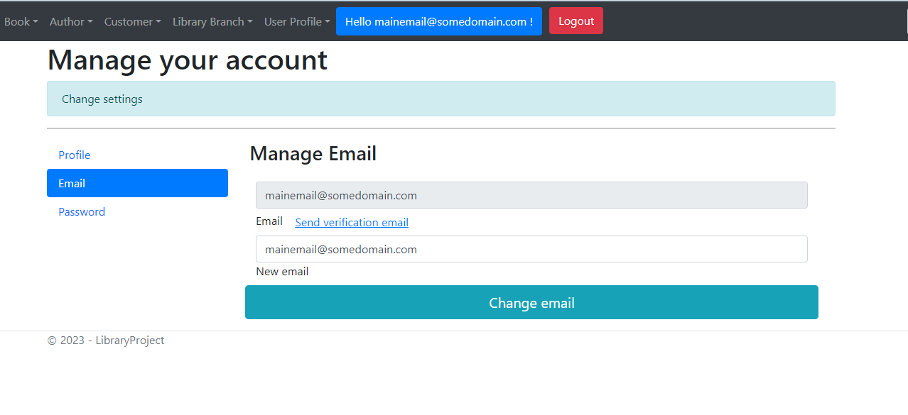
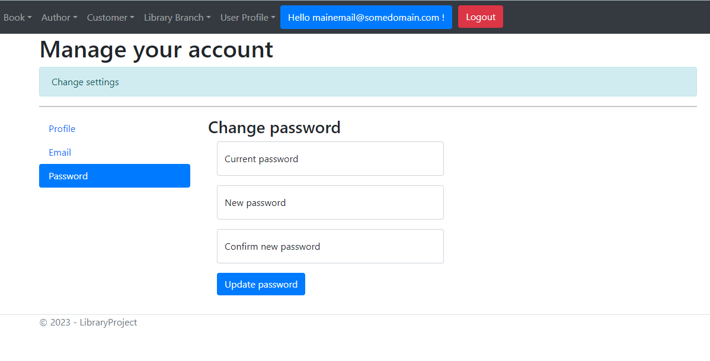
 

## Contributing
Feel free to contribute to the development of this project by opening issues or pull requests. Your feedback is highly appreciated!

